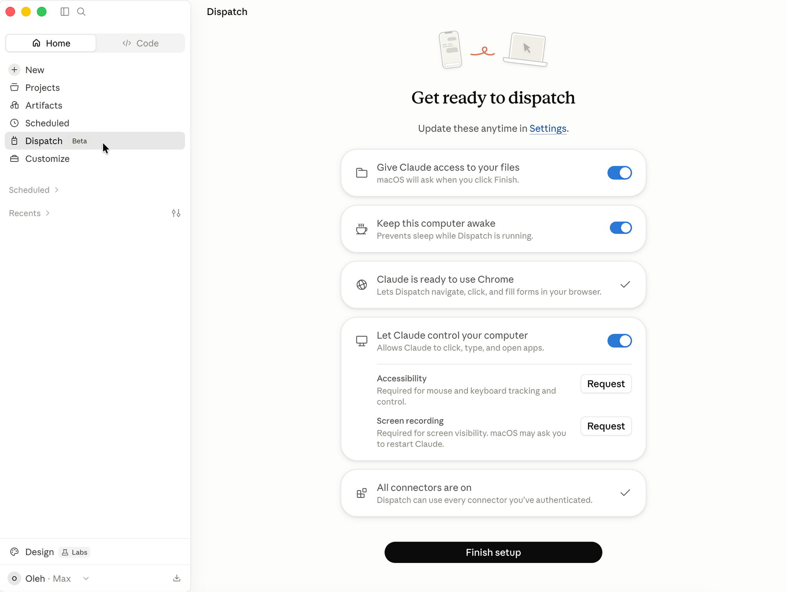

# Керування з мобільного (dispatch)

Частину роботи асистента можна запускати й контролювати з телефона: поставити завдання дорогою, глянути результат регулярної задачі, підтвердити крок агента. Комп'ютер лишається робочою конякою, а телефон стає пультом.

## Claude: Dispatch

**Dispatch** — це функція всередині Claude Cowork, яка дозволяє з мобільного застосунку ставити завдання, що виконуються на вашому комп'ютері. Телефон надсилає інструкцію, а вся робота відбувається на вашому Mac або PC через застосунок Claude Desktop, з доступом до локальних файлів і під'єднаних сервісів. Розмова синхронізується між пристроями, тож почати можна на телефоні, а продовжити за комп'ютером.

Важлива умова: комп'ютер має бути ввімкнений, а Claude Desktop відкритий. Доступно у бета-версії для планів Pro і Max.

**Як налаштувати:**

1. Оновіть Claude Desktop і застосунок Claude для iOS або Android.
2. Відкрийте Cowork і натисніть **Dispatch** на лівій панелі, далі **Get started**.
3. Увімкніть доступ Claude до файлів і опцію тримати комп'ютер увімкненим, натисніть **Finish setup**.
4. Пишіть завдання з телефона в розділі **Dispatch**. Він використовує все, що ви вже під'єднали в Cowork.

Офіційне джерело: [Assign tasks from anywhere](https://support.claude.com/en/articles/13947068-assign-tasks-from-anywhere-in-claude-cowork).

## ChatGPT: Work і Scheduled Tasks

У ChatGPT мобільний відповідник складається з двох частин. **ChatGPT Work** — це агент для довших багатокрокових завдань, доступний у застосунку: описуєте завдання, стежите за прогресом і підтверджуєте дії з телефона. **Scheduled Tasks** — це сторінка «Scheduled» у бічній панелі застосунку, де ви створюєте разові, повторювані чи моніторингові задачі. Про завершення приходить push-сповіщення або лист.

**Як налаштувати заплановані задачі:**

1. Відкрийте ChatGPT у мобільному застосунку.
2. У бічній панелі відкрийте сторінку **Scheduled** і створіть нову задачу звичайною мовою.
3. Виберіть час запуску й тип задачі, увімкніть push- або email-сповіщення в налаштуваннях.

Обмеження: кількість активних задач залежить від плану (Plus до 5, Pro та Enterprise до 15), а запуск відбувається не частіше ніж раз на годину.

Офіційна довідка: [ChatGPT Work](https://help.openai.com/en/articles/20001275-chatgpt-work-and-codex) · [Scheduled Tasks](https://help.openai.com/en/articles/10291617-scheduled-tasks-in-chatgpt).

!!! note "Фонове виконання без увімкненого пристрою"
    Dispatch працює, поки ваш комп'ютер увімкнений. Якщо задача має виконуватися сама навіть із закритим ноутбуком, це вже хмарні задачі: див. [Регулярні задачі](schedule.md).
