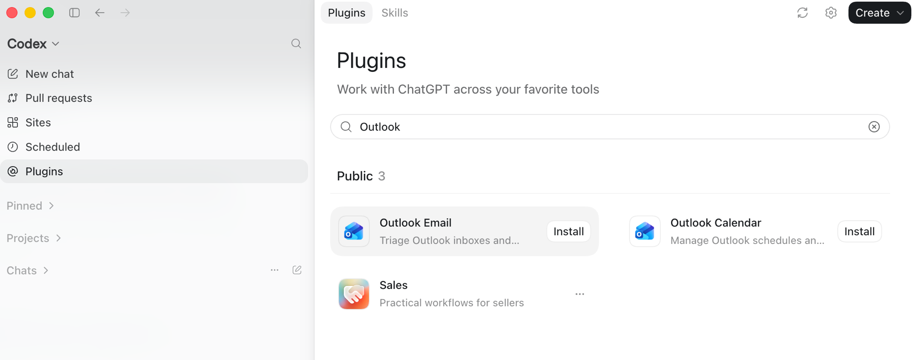

# Плагіни (конектори)

Асистент стає корисним, коли бачить ваші дані. Плагіни (їх також називають конекторами) підключають його до сервісів, якими ви вже користуєтесь: пошти, календаря, CRM, диску. Ви самі обираєте, що підключити. Конкретний продукт не важливий: асистент працює з напрямом, а бренд може бути будь-який.

## Що варто підключити

| Напрям | Що відкриває | Наприклад |
| --- | --- | --- |
| Пошта | Листи, треди, вкладення | Gmail, Outlook |
| Календар | Зустрічі, події, розклад | Google Calendar, Outlook |
| CRM | Клієнти, угоди, контакти | HubSpot, Pipedrive, Salesforce |
| Документи | Файли, таблиці, папки | Google Drive / Docs, OneDrive |
| Веб | Пошук і сторінки в інтернеті | вбудований веб-пошук або браузер |

!!! tip "З чого почати"
    Не підключайте все одразу. Почніть з 1–2 джерел, якими користуєтесь щодня (пошта і календар), а решту додасте потім.

## ChatGPT

Рекомендований базовий набір і те, для чого потрібен кожен плагін.

| Плагін | Для чого | Джерело |
| --- | --- | --- |
| Documents | Читання файлів і вкладень | [OpenAI Help](https://help.openai.com/) |
| Gmail / Outlook | Листи, треди, чернетки | [Connectors](https://help.openai.com/) |
| Google Calendar / Outlook Calendar | Зустрічі та розклад | [Connectors](https://help.openai.com/) |
| Google Drive | Файли й папки в хмарі | [Connectors](https://help.openai.com/) |
| Slack / Teams / Zoom | Командні комунікації | [Connectors](https://help.openai.com/) |
| HubSpot / Attio / Zoho | Клієнти й угоди (CRM) | [Connectors](https://help.openai.com/) |
| GitHub | Стан розробки | [Connectors](https://help.openai.com/) |
| Notion | Бази знань і нотатки | [Connectors](https://help.openai.com/) |
| Chrome | Дії у браузері | [ChatGPT-агент](https://help.openai.com/en/articles/20001275-chatgpt-work-and-codex) |
| Data Analytics | Аналіз даних і графіки | [OpenAI Help](https://help.openai.com/) |
| Presentations | Створення презентацій | [OpenAI Help](https://help.openai.com/) |
| Sales | Інструменти продажів | [Connectors](https://help.openai.com/) |

### Як увімкнути в ChatGPT

1. Відкрийте ChatGPT → **Settings** (Налаштування) → **Connectors** (Конектори).
2. Оберіть сервіс і натисніть **Connect**. У вікні входу (Google, Microsoft, HubSpot тощо) підтвердьте дозволи.
3. У чаті натисніть **«+»** або меню інструментів і увімкніть конектор як джерело для цього запиту.
4. Вбудовані можливості (завантаження файлів і аналіз даних) доступні одразу, вмикати їх не треба.

Частина конекторів працює на платних планах, а в робочих акаунтах їх спершу вмикає адміністратор організації. Кожен рядок таблиці має посилання на офіційну довідку OpenAI.

<!-- Скріншот: екран Settings → Connectors у ChatGPT. Додайте PNG у docs/assets/ і розкоментуйте рядок нижче: -->
<!--  -->

## Claude

Ті самі напрями в Claude. Кожне посилання веде на офіційну довідку Anthropic.

| Плагін | Для чого | Джерело |
| --- | --- | --- |
| Завантаження файлів (вбудовано) | Читання файлів і вкладень | [Upload files](https://support.claude.com/en/articles/8241126-upload-files-to-claude) |
| Конектор Gmail (Google Workspace) | Листи, треди, чернетки | [Google Workspace](https://support.claude.com/en/articles/10166901-use-google-workspace-connectors) |
| Конектор Google Calendar | Зустрічі та розклад | [Google Workspace](https://support.claude.com/en/articles/10166901-use-google-workspace-connectors) |
| Конектор Google Drive | Файли й папки в хмарі | [Google Workspace](https://support.claude.com/en/articles/10166901-use-google-workspace-connectors) |
| Конектор Slack (Teams/Zoom через сторонні) | Командні комунікації | [Claude в Slack](https://support.claude.com/en/articles/11506255-get-started-with-claude-in-slack) |
| Конектор HubSpot | Клієнти й угоди (CRM) | [HubSpot](https://claude.com/connectors/hubspot) |
| Інтеграція GitHub | Стан розробки | [GitHub](https://support.claude.com/en/articles/10167454-use-the-github-integration) |
| Конектор Notion | Бази знань і нотатки | [Notion](https://claude.com/connectors/notion) |
| Claude for Chrome (розширення) | Дії у браузері | [Claude in Chrome](https://support.claude.com/en/articles/12012173-get-started-with-claude-in-chrome) |
| Виконання коду та файлів (вбудовано) | Аналіз даних і графіки | [Code & files](https://support.claude.com/en/articles/12111783-create-and-edit-files-with-claude) |
| Конектор Canva + Artifacts | Створення презентацій | [Canva](https://claude.com/connectors/canva) |
| Директорія конекторів | Продажі, CRM, інші сервіси | [Всі конектори](https://claude.com/connectors) |

### Як увімкнути в Claude

1. Відкрийте claude.ai або застосунок Claude Desktop і перейдіть у **Settings → Connectors** (Налаштування → Конектори).
2. Натисніть **«+» → Browse connectors**, щоб відкрити Директорію конекторів.
3. Знайдіть потрібний сервіс (наприклад Gmail, HubSpot, Notion) і натисніть **Connect**. У вікні OAuth увійдіть і підтвердьте дозволи.
4. У чаті натисніть **«+»** (Search and tools) і увімкніть конектор як джерело.

Вбудовані функції — завантаження файлів і виконання коду — доступні одразу. Веб-конектори працюють на платних тарифах (Pro, Max, Team, Enterprise); у Team та Enterprise конектор спершу вмикає власник організації.

<!-- Скріншот: екран Settings → Connectors у Claude. Додайте PNG у docs/assets/ і розкоментуйте рядок нижче: -->
<!--  -->
