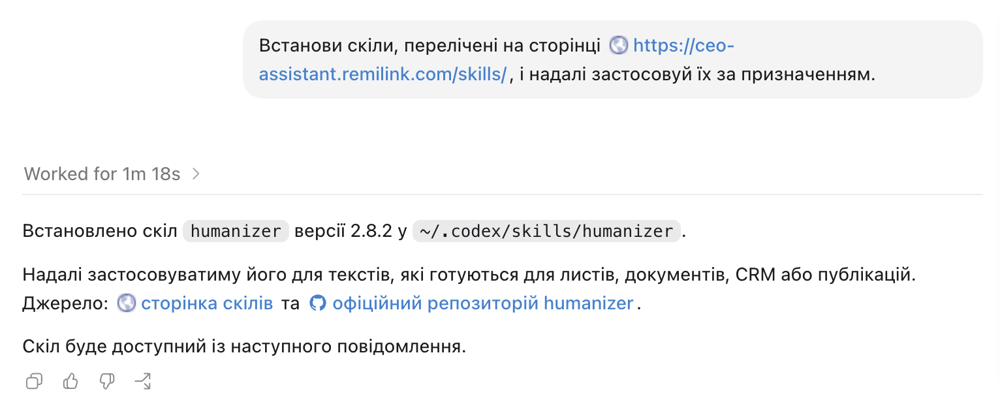

---
hide:
  - toc
---

# Скіли

Конектор дає асистенту доступ до даних. Скіл дає йому метод: сталий спосіб виконати задачу, за яким чеклістом писати, як форматувати звіт, яких помилок уникати. Один раз підключили, і асистент застосовує цей метод у кожній відповіді, без нагадувань у промпті.

Для керівника найкорисніші скіли стосуються тексту й документів, які потім читає хтось інший: листи, нотатки в CRM, підсумки зустрічей, дописи.

Відкрийте картку скіла: праворуч зʼявиться, що він робить, коли його застосовувати й команда для встановлення.

<button class="rl-chip is-active" type="button" data-tag="">Всі</button>
<button class="rl-chip" type="button" data-tag="текст">текст</button>
<button class="rl-chip" type="button" data-tag="ідеї">ідеї</button>
<button class="rl-chip" type="button" data-tag="маркетинг">маркетинг</button>
<button class="rl-chip" type="button" data-tag="аналітика">аналітика</button>
<button class="rl-chip" type="button" data-tag="комунікація">комунікація</button>

<ul class="rl-cards">
<li class="rl-card" data-slug="humanizer" data-tags="текст комунікація">
<button class="rl-card__head" type="button" aria-expanded="false" aria-controls="rl-body-humanizer">✍️Humanizerолюднення тексту</button>

Прибирає ознаки AI-письма: штампи, шаблонні звороти, зайві тире й «воду». Застосовуйте до будь-якого тексту, який читатиме хтось інший: листів, нотаток у CRM, документів, дописів.

текст комунікація

</li>
<li class="rl-card" data-slug="creative-ideation" data-tags="ідеї маркетинг">
<button class="rl-card__head" type="button" aria-expanded="false" aria-controls="rl-body-creative">💡Creative Ideationгенерація ідей</button>

Допомагає швидко згенерувати багато різних напрямів, коли треба вийти за межі очевидного: назви, кампанії, продуктові гіпотези, кути подачі.

ідеї маркетинг

</li>
<li class="rl-card" data-slug="verbalized-sampling" data-tags="ідеї аналітика">
<button class="rl-card__head" type="button" aria-expanded="false" aria-controls="rl-body-vs">🎲Verbalized Samplingрізні варіанти відповіді</button>

Змушує асистента давати кілька різних варіантів замість одного усередненого. Корисно для брейнштормів і там, де перший варіант завжди виходить однаковим.

ідеї аналітика

</li>
<li class="rl-card" data-slug="karpathy-skills" data-tags="аналітика текст">
<button class="rl-card__head" type="button" aria-expanded="false" aria-controls="rl-body-karpathy">🧠Karpathy Skillsнабір робочих навичок</button>

Добірка навичок у стилі підходів Андрія Карпаті: ясніше мислення, охайна робота з даними й кодом, прості пояснення складного.

аналітика текст

</li>
</ul>

<aside class="rl-app__viewer" data-rl-viewer>

Оберіть скіл ліворуч. Опис і команда для встановлення зʼявляться тут.

</aside>

<template data-detail="humanizer"><h4>Що робить</h4>
Переписує згенерований текст так, щоб він звучав по-людськи: прибирає канцелярит, шаблонні звороти, надмірні узагальнення й зайві тире. В основі — гайд Вікіпедії «Signs of AI writing».
<h4>Коли застосовувати</h4><ul><li>листи клієнтам і партнерам;</li><li>нотатки в CRM і підсумки зустрічей;</li><li>дописи, презентації, будь-який текст назовні.</li></ul><h4>Встановлення</h4>
Крос-платформно: <code>npx skills add blader/humanizer</code>. У Claude також як плагін: <code>/plugin marketplace add blader/humanizer</code>, далі <code>/plugin install humanizer@humanizer</code>.

<a href="https://github.com/blader/humanizer">Репозиторій на GitHub →</a>
</template>
<template data-detail="creative-ideation"><h4>Що робить</h4>
Веде асистента через дивергентне мислення: замість одного «правильного» варіанта він видає широкий спектр несхожих ідей, а тоді допомагає їх звузити.
<h4>Коли застосовувати</h4><ul><li>назви продуктів, кампаній, рубрик;</li><li>гіпотези для тестів і лідмагнітів;</li><li>кути подачі для контенту.</li></ul><h4>Встановлення</h4>
Через skills CLI: <code>npx skills add NousResearch/hermes-agent</code>. Сам скіл лежить у теці <code>optional-skills/creative/creative-ideation</code>.

<a href="https://github.com/NousResearch/hermes-agent/tree/main/optional-skills/creative/creative-ideation">Репозиторій на GitHub →</a>
</template>
<template data-detail="verbalized-sampling"><h4>Що робить</h4>
Метод підказки, за яким асистент проговорює кілька варіантів відповіді з різною ймовірністю замість одного найбільш очікуваного. Так повертається різноманіття, яке моделі зазвичай згладжують.
<h4>Коли застосовувати</h4><ul><li>брейншторми, де потрібні несхожі варіанти;</li><li>заголовки й копірайтинг;</li><li>задачі, де перша відповідь завжди однакова.</li></ul><h4>Встановлення</h4>
Через skills CLI: <code>npx skills add CHATS-lab/verbalized-sampling</code>.

<a href="https://github.com/CHATS-lab/verbalized-sampling">Репозиторій на GitHub →</a>
</template>
<template data-detail="karpathy-skills"><h4>Що робить</h4>
Набір готових навичок, зібраних за принципами роботи Андрія Карпаті: структуроване мислення, робота з даними, чіткі й короткі пояснення.
<h4>Коли застосовувати</h4><ul><li>розбір складних тем простими словами;</li><li>аналіз даних і перевірка міркувань;</li><li>підготовка технічних матеріалів.</li></ul><h4>Встановлення</h4>
Через skills CLI: <code>npx skills add multica-ai/andrej-karpathy-skills</code>.

<a href="https://github.com/multica-ai/andrej-karpathy-skills">Репозиторій на GitHub →</a>
</template>

## Найпростіший спосіб встановити

Не встановлюйте кожен скіл вручну. Попросіть асистента встановити весь список вище. Скажіть ChatGPT або Claude:

> Встанови скіли, перелічені на сторінці https://ceo-assistant.remilink.com/skills/, і надалі застосовуй їх за призначенням.

Асистент відкриє цю сторінку, знайде перелік і встановить кожен скіл. Далі він застосовуватиме їх сам, коли задача цього потребує.

## Як вказувати скіл у промптах

Якщо скіл встановлено в асистенті, він застосовується сам, окремо в промпті вказувати не треба. Якщо скіл не встановлено, є два варіанти: згадати його в запиті (`застосуй humanizer`) або вписати його правила текстом, наприклад:

> Після того, як напишеш текст, застосуй принципи humanizer: прибери типові ознаки AI-письма (штампи, надлишкові узагальнення, шаблонні звороти й «воду»). Залиш просте, конкретне формулювання.

## Свій метод як скіл

Будь-яку повторювану інструкцію можна оформити як скіл і не повторювати щоразу:

- **Бренд-голос** — єдиний тон і словник у всіх листах та дописах.
- **Структура звітів** — один формат вихідних документів: розділи, порядок, рівень деталізації.
- **Правила комунікації** — чого не писати клієнтам, як звертатися, які дані не розкривати.

Оформлення власних скілів описано в офіційній документації: [docs.claude.com](https://docs.claude.com/en/resources/prompt-library).

!!! note "Де побачити встановлені скіли"
    Перелік підключених навичок видно в налаштуваннях асистента: у Claude — у розділі зі скілами (Capabilities), у ChatGPT — у розділі навичок і застосунків.
